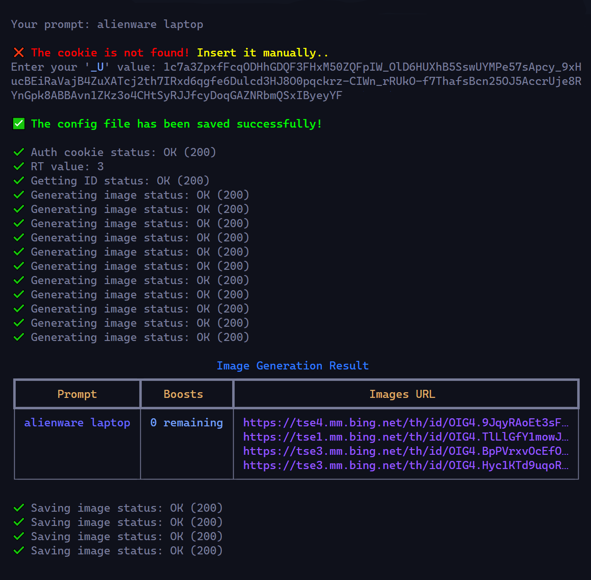

<div align="center">


**Bing-Dalle** Image Creator from Microsoft Designer.



</div>

## **Installation**

**Using** _`poetry`_

```
git clone https://github.com/x404xx/Bing-Dalle.git
cd Bing-Dalle
poetry shell
poetry install
```

**Using** _`pip`_

```
git clone https://github.com/x404xx/Bing-Dalle.git
cd Bing-Dalle
virtualenv env
env/scripts/activate
pip install -r requirements.txt
```

## Cookies

-   Open **Microsoft Edge** and press `f12` for console.
-   Go to **Application** → **Storage** → **Cookies** → `_U`. Copy the value of that cookie.
    > ⚠️ **Warning :** The `_U` auth cookie should be changed every 2-4 weeks for working.

## Usage

-   _**`When you execute the command below, it will ask you for a cookie manually. Just follow the given steps in the terminal`**_
    > If you don't specify the downloaded image folder path, it will save the downloaded images in the current directory.

```python
python -m bingdalle
```

-   _**`Full command examples`**_

```python
python -m bingdalle 'your prompt' -c 'your _U cookie value' -o 'your downloaded images folder path'
```

## Help

```
usage: python -m bingdalle [-h] [-c AUTH_COOKIE] [-o OUT_DIRECTORY] [-uc] [prompt]

Generate images with Bing Image Creator

positional arguments:
prompt                Your prompt

options:
-h, --help            show this help message and exit
-c AUTH_COOKIE, --auth_cookie AUTH_COOKIE
                        Your '_U' cookie value
-o OUT_DIRECTORY, --out_directory OUT_DIRECTORY
                        Your downloaded images folder path
-uc, --update_config  Update the configuration file
```

## Update configuration

> Assuming you already have a JSON file, then you need to update a new cookie or downloaded image folder path.

-   _**`For cookie`**_

-   [x] Make sure you set the downloaded image folder path again when updating new cookies; if not, it will be set to the default current directory, or just use a combining method instead.

```python
python -m bingdalle -uc -c 'your new cookie'
```

-   _**`For downloaded images, folder paths`**_

```python
python -m bingdalle -uc -o 'your downloaded images folder path'
```

-   _**`Combine cookie and downloaded images folder path`**_

```python
python -m bingdalle -uc -c 'your new cookie' -o 'your downloaded images folder path'
```

## Final

-   _**`After all the setup is finished, you can just run the command below`**_

```python
python -m bingdalle 'your prompt'
```

## Notes

> **The cookie and downloaded images folder path will be saved to a JSON file automatically. Once set, it will be loaded automatically and reused. There is no need to set again for the next uses.**

## Output

-   [Saved Images](https://github.com/x404xx/Bing-Dalle/tree/main/Downloaded%20Images)

## **Legal Disclaimer**

> This was made for educational purposes only, nobody which directly involved in this project is responsible for any damages caused. **_You are responsible for your actions._**
